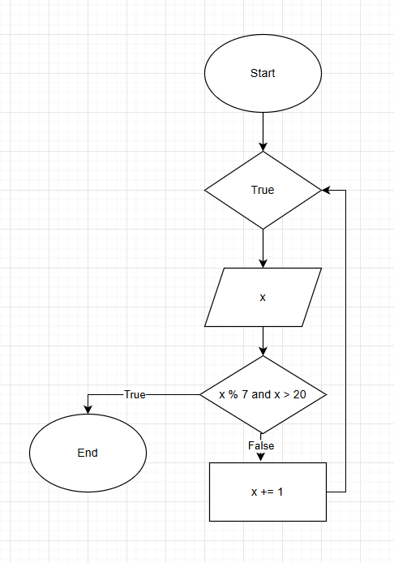
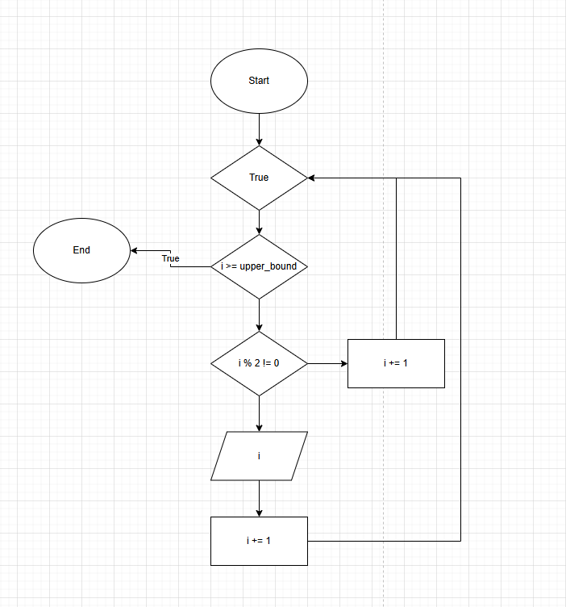

# Loops Part 2

---
```break``` - конструкція для дострокового завершення циклу. При виклику ```break``` цикл одразу завершиться

```python
x = 1

while True:
    print(x)
    if x % 7 == 0 and x > 20:
        break
    x += 1

print('End')
```


---
```continue``` - конструкція для пропуска ітерації. При її виклику ми пропускаємо увесь наступний код після ```continue``` та повертаємось на почток циклу
```python
lower_bound = 0
upper_bound = 15

i = lower_bound

while True:
    if i >= upper_bound:
        break

    if i % 2 != 0:
        i += 1
        continue

    print(i)
    i += 1
```


---
```python
import math

x = 97

i = 2

is_prime = True

iteration_count = 0

while i < math.ceil(math.sqrt(x)):
    iteration_count += 1
    if x % i == 0:
        is_prime = False
        break
    i += 1

print(is_prime)
print(iteration_count)
print(math.ceil(math.sqrt(x)))
```
---
```else```
```python
number = 1

while number <= 5:
    print(number)
    if number == 4:
        break
    number += 1

else:
    print('End')
```
```python
line = 'Hello world!'

for i in range(len(line)):
    print(line[i])
    print(i)

for i in range(10, 101, 10):
    if i > 50:
        break

    print(i)
```

```python
i = 0

for row in range(10):
    print('██' * 10)
    i += 1

print(i)
```

```python
i = 0

for row in range(10):
    for column in range(10):
        print('██', end='')
    print()

print(i)
```